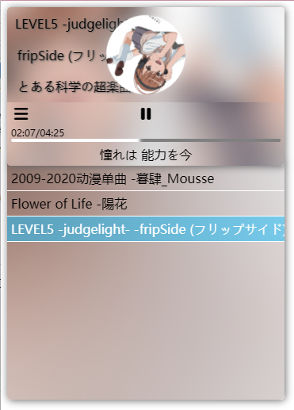

# HTML-Music-Player
 A html music player



 html+css+javascript+php+sql

 demo:https://www.aoralsfout.cn/music

### 数据库结构👇

```sql
CREATE TABLE `musics` (
  `id` int(255) NOT NULL DEFAULT '0',
  `title` varchar(50) COLLATE utf8_unicode_ci DEFAULT NULL,
  `album` varchar(50) COLLATE utf8_unicode_ci DEFAULT NULL,
  `author` varchar(50) COLLATE utf8_unicode_ci DEFAULT NULL,
  PRIMARY KEY (`id`)
) ENGINE=MyISAM DEFAULT CHARSET=utf8 COLLATE=utf8_unicode_ci;

INSERT INTO `musics` (`id`, `title`, `address`, `cover`, `lrc`, `album`, `author`) VALUES
	(0, '2009-2020动漫单曲', NULL, '暮肆_Mousse')

```
